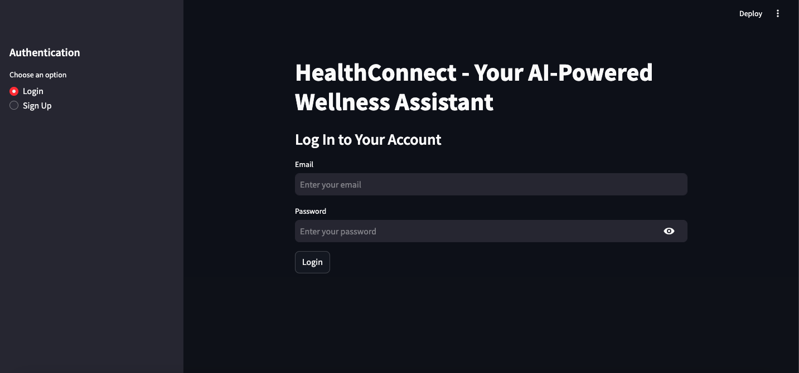
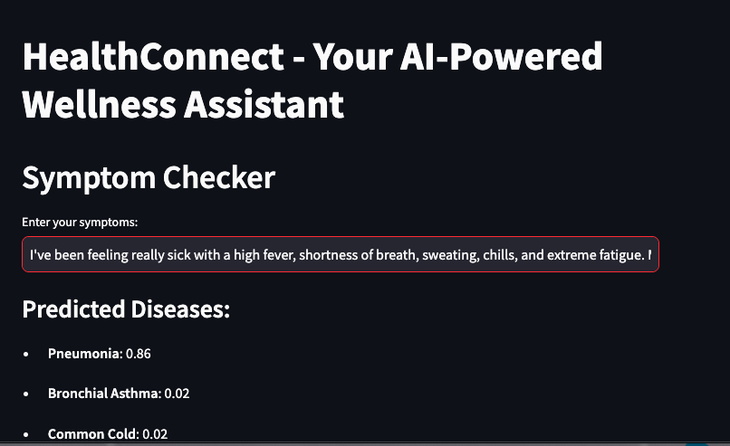
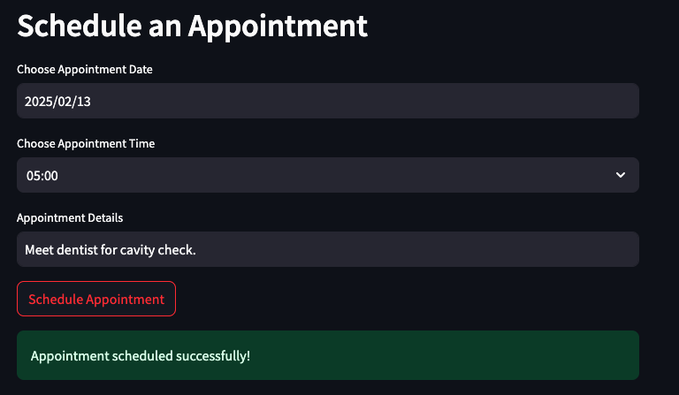
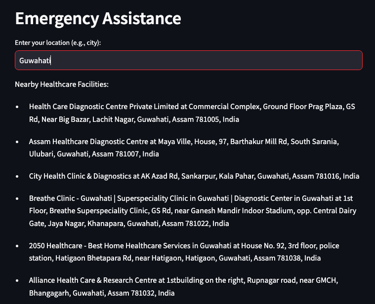
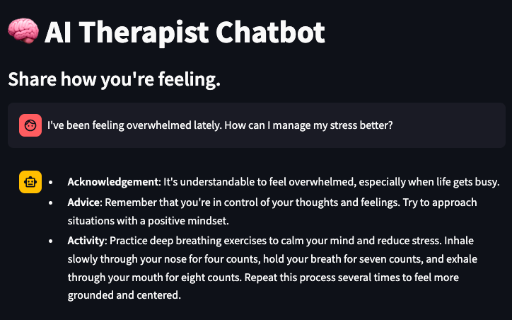

# **HealthConnect** 🏥💙  

HealthConnect is an AI-powered health assistant that provides symptom checking, mental health support , appointment scheduling and emergency assistance. It integrates *BioBERT* for symptom prediction, *Google Maps* for nearby healthcare facilities, *Google Calendar* for appointment scheduling, and *Firebase authentication* for user management.  

---
## 📸 **Model Features**

### Login Page : 



### Symptom Checker : 



### Appointment Scheduling : 



### Emergency Assistance : 



### AI-Therapist Chatbot : 


---

## *Features* 🚀  

✔️ *Symptom Checker* – Uses a fine-tuned *BioBERT* model to predict possible diseases based on symptoms.  
✔️ *Mental Health Chatbot* – Provides mental health support using AI-powered responses.    
✔️ *Emergency Assistance* – Locates the nearest healthcare facilities using *Google Maps API*.  
✔️ *Appointment Scheduling* – Integrates with *Google Calendar* to schedule medical appointments.  
✔️ *User Authentication* – Secure login and authentication with *Firebase*.  

---

## 🛠 **Technologies Used**

- **Programming Language**: Python
- **Framework**: Streamlit (Frontend)
- **Machine Learning Models**:
  - **BioBERT** (Fine-tuned for symptom checking)
  - **gemini-pro** (for mental health chatbot)
- **APIs**:
  - Google Calendar API
  - Google Maps API
  - Firebase Authentication

---

## ⚡ **Installation Guide**

Follow these steps to set up and run the project:

### 1️⃣ Clone the Repository
```bash
git clone https://github.com/dola-11/healthConnect.git
cd HealthConnect
```
### 2️⃣ Install Dependencies
```bash
pip install -r requirements.txt
```
### 3️⃣ Set Up Environment Variables
Create a .env file in the root directory and add:
```bash
HUGGINGFACE_API_KEY=your_huggingface_key
GOOGLE_MAPS_API_KEY=your_google_maps_key
GOOGLE_API_KEY=your_google_key
FIREBASE_CREDENTIALS=your_firebase_credentials.json
GOOGLE_CREDENTIALS=your_google_credentials.json
```
### 4️⃣ Run the Application
```bash
streamlit run app.py
```


